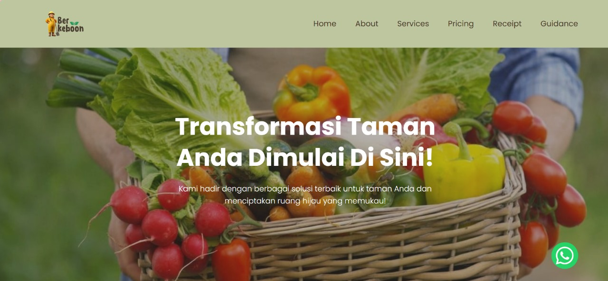
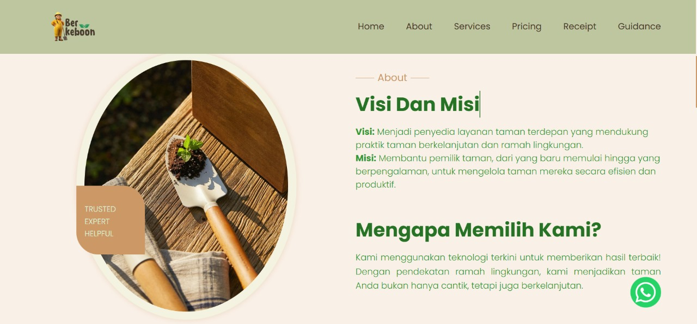
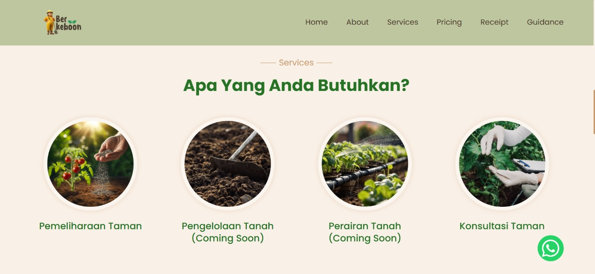
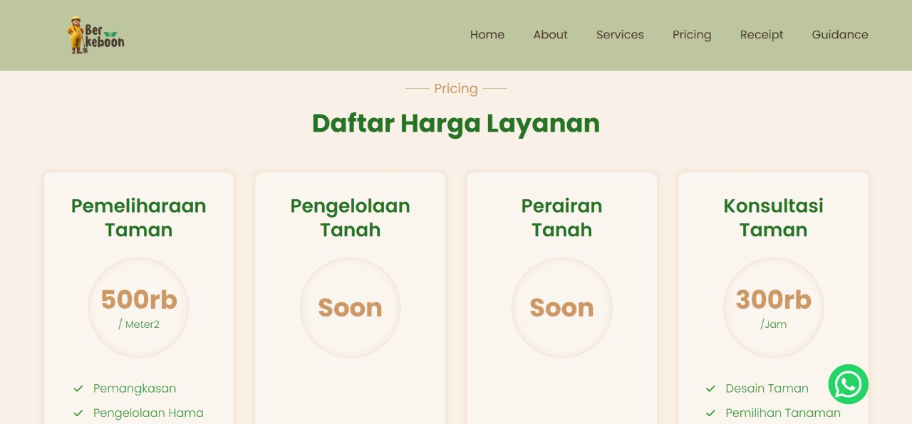
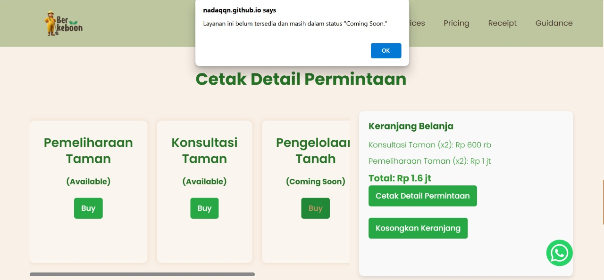

# 🌿 Berkeboon – Website Layanan Pemeliharaan Taman

**Berkeboon** adalah sebuah website layanan pemeliharaan taman yang memudahkan pengguna dalam memesan jasa seperti perawatan taman, konsultasi, dan pengelolaan lingkungan taman secara online.  
Website ini dibangun menggunakan **HTML**, **CSS**, dan **JavaScript**, serta di-host melalui **GitHub Pages**.

> Solusi modern untuk taman yang lebih hijau, sehat, dan terawat.

---

## 🌐 Fitur Utama

### 🏠 Home Page
- Navigasi ke seluruh halaman layanan
- Desain user-friendly dan responsive

### 📖 About Page
- Informasi tentang visi, misi, manfaat, dan nilai unik Berkeboon

### 🛠️ Services Page
- Daftar layanan seperti:
  - Perawatan taman
  - Konsultasi taman
  - Pengelolaan tanah
  - Sistem perairan
  - *(Beberapa layanan masih dalam tahap coming soon)*

### 💰 Pricing Page
- Rincian harga untuk setiap layanan
- Menampilkan manfaat layanan secara transparan

### 🧾 Receipt Page
- Menyimpan layanan yang telah dipilih pengguna
- Menampilkan keranjang belanja
- Memberikan notifikasi jika layanan belum tersedia

### 📋 Guidance Page
- Panduan pemesanan yang mudah diikuti untuk pengguna baru

### 📞 Contact Section
- Formulir untuk mengirim invoice atau menghubungi tim Berkeboon langsung

---

## 🎯 Tujuan Berkeboon

- ✅ Mempermudah pemesanan jasa taman secara online  
- 🌱 Menyediakan informasi layanan dan harga yang transparan  
- 📥 Mempercepat komunikasi antara pelanggan dan tim Berkeboon  
- 🚀 Memberikan pengalaman pemesanan jasa yang modern dan praktis  

---

## 🛠️ Teknologi yang Digunakan

- HTML5  
- CSS3  
- JavaScript  
- GitHub Pages (untuk hosting)

---

## 📸 Tampilan Website (Preview)

---

## 📬 Hubungi Kami

📧 Linktr.ee: https://linktr.ee/qonitaqq
